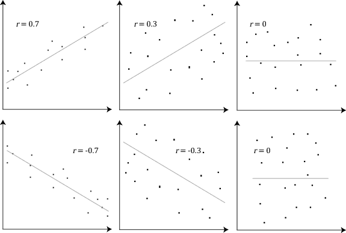
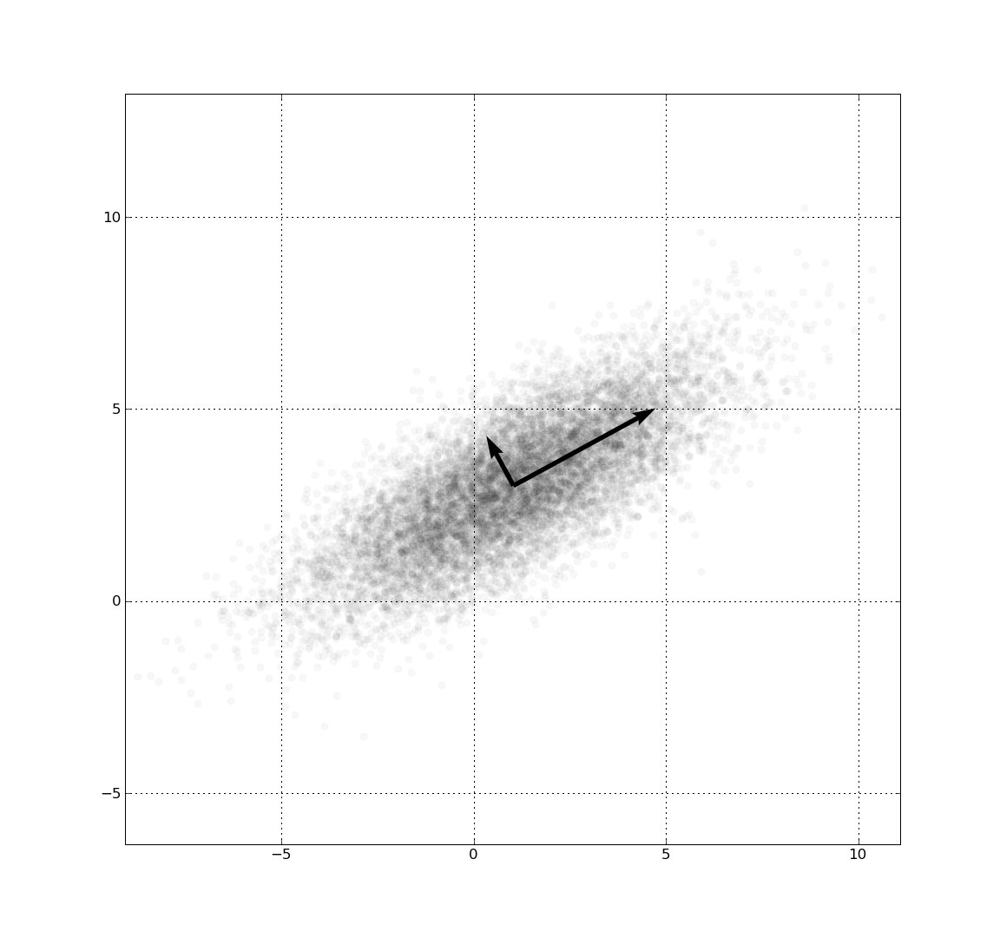

# Variable Correlation and Bivariance in Advanced ML I

## Summary
This assignment explores the concepts of correlation and bivariance, their mathematical basis, the impact on data models, and their relevance to advanced machine learning. It also reflects on how these concepts may influence our future careers and professional development in data science and machine learning.

## Table of Contents
1. [Introduction](#introduction)
2. [Mathematical Basis of Correlation and Bivariance](#mathematical-basis-of-correlation-and-bivariance)
   - 2.1 [Correlation: Definition and Equation](#correlation-definition-and-equation)
   - 2.2 [Bivariance: Definition and Equation](#bivariance-definition-and-equation)
3. [Data Models Affected by Correlation and Bivariance](#data-models-affected-by-correlation-and-bivariance)
   - 3.1 [Types of Data Models](#types-of-data-models)
   - 3.2 [Real-World Examples](#real-world-examples)
4. [Relation to Course Topics](#relation-to-course-topics)
   - 4.1 [Connections to Key Concepts in Advanced ML I](#connections-to-key-concepts-in-advanced-ml-i)
   - 4.2 [Applications in Machine Learning Algorithms](#applications-in-machine-learning-algorithms)
5. [Individual Impact and Career Reflections](#individual-impact-and-career-reflections)
   - 5.1 [Application in Future Careers](#application-in-future-careers)
   - 5.2 [Role in Internships and Job Opportunities](#role-in-internships-and-job-opportunities)
6. [Conclusion](#conclusion)

## Authors
- **Bastien Cherel**: [[GitHub](https://github.com/BastienCherel), Data Science Enthusiast]
- **Jinyoung Ko**: [Brief bio or role, e.g., Machine Learning Enthusiast]
- **Sainan Bi**: [Brief bio or role, e.g., Computer Science Major]
- **Name 4**: [Optional, if applicable]

---

## Introduction

In this assignment, we explore two critical concepts in statistics and data analysis: **correlation** and **bivariance**. Both of these concepts play significant roles in understanding the relationships between variables and their impact on data models. Correlation measures the strength and direction of a linear relationship between two variables, providing insights into whether changes in one variable are associated with changes in another. On the other hand, bivariance (or covariance) evaluates the extent to which two variables change together, indicating the degree to which the variability in one variable is related to the variability in another.

These concepts are foundational in machine learning and data science, as they influence data preprocessing, feature selection, model performance, and interpretability. For example, when building predictive models, understanding correlations can help in identifying redundant features, ensuring the choice of features that contribute meaningful information. Similarly, bivariance helps assess the variability between features, which is crucial for understanding how data features interact and affect model predictions.

The goals of this assignment are as follows:
- To explain the mathematical basis of correlation and bivariance, including their equations.
- To identify the data models that are affected by these concepts and discuss how they influence model outcomes.
- To relate correlation and bivariance to advanced machine learning topics covered in the course, such as feature selection, model evaluation, and data preprocessing.
- To reflect on how understanding these concepts can impact future career opportunities and the application of these insights during internships and job roles.

Understanding correlation and bivariance is essential for data scientists, machine learning engineers, and researchers who work with complex datasets. By grasping these fundamental concepts, one can better design, refine, and interpret models to derive more accurate and meaningful insights from data.

---

## Mathematical Basis of Correlation and Bivariance

### 2.1 Correlation: Definition and Equation

The sample correlation coefficient, denoted by  r , measures the strength and direction of the linear relationship between two variables  X  and  Y . It is defined as:

$$
r = \frac{\sum_{i=1}^{n} (x_i - \bar{x})(y_i - \bar{y})}{\sqrt{\sum_{i=1}^{n} (x_i - \bar{x})^2} \sqrt{\sum_{i=1}^{n} (y_i - \bar{y})^2}}
$$

where:
-  $$x_i$$  and  $$y_i$$  are the individual data points for  X  and  Y ,
-  $$\bar{x}$$  and  $$\bar{y}$$  are the sample means of  X  and  Y ,
-  $$n$$  is the number of data points.

The value of  r  ranges from -1 to 1:
-  $$r = 1$$  indicates a perfect positive linear relationship,
-  $$r = -1$$  indicates a perfect negative linear relationship,
-  $$r = 0$$  indicates no linear correlation.

### 2.2 Bivariance: Definition and Equation

The sample bivariance, also known as sample covariance, measures the degree to which two variables  X  and  Y  vary together. It is defined as:

$$
s_{XY} = \frac{\sum_{i=1}^{n} (x_i - \bar{x})(y_i - \bar{y})}{n - 1}
$$

where:
-  $$x_i$$  and  $$y_i$$  are the individual data points for  X  and  Y ,
-  $$\bar{x}$$  and  $$\bar{y}$$  are the sample means of  X  and  Y ,
-  $$n$$  is the number of data points.

The sample covariance  $$s_{XY}$$  can take any real value:
- If  $$s_{XY} > 0$$ , it indicates that  X  and  Y  tend to increase together (positive relationship).
- If  $$s_{XY} < 0$$ , it indicates that as one variable increases, the other tends to decrease (negative relationship).
- If  $$s_{XY} = 0$$ , there is no linear relationship between the variables.

## Data Models Affected by Correlation and Bivariance

### 3.1 Types of Data Models

Variable correlation and bivariance affect different types of machine learning models in various ways. Linear regression is particularly sensitive to multicollinearity, as highly correlated predictors can distort coefficients and reduce the model’s interpretability. Regularization techniques like LASSO or Ridge regression are often employed to address this issue. Decision trees, on the other hand, are less affected by correlation because they split on the most informative features at each step. However, correlated variables can still lead to redundant splits, which may affect model efficiency. Neural networks can handle complex relationships between features but are prone to overfitting when correlated inputs dominate the training process, making techniques like dropout or feature selection crucial.

### 3.2 Real-World Examples

In practice, the effects of correlation and bivariance are evident in several domains. For instance, in healthcare, predicting patient outcomes often involves highly correlated variables such as age, BMI, and blood pressure. Ignoring these relationships can result in unstable models, while addressing them ensures more reliable predictions. In finance, forecasting stock prices often requires handling correlations between market indicators like interest rates and exchange rates; failure to account for these interactions can lead to inaccurate forecasts. In e-commerce, recommendation systems rely on understanding the relationships between user preferences and product attributes to improve recommendations. Properly managing correlations in these scenarios not only enhances model performance but also ensures more meaningful and actionable insights.

## Relation to Course Topics

### 4.1 Connections to Key Concepts in Advanced ML I

In machine learning, managing correlated features is key to simplifying models and improving their reliability. For instance, removing redundant predictors ensures the model focuses on the most relevant information without unnecessary complexity. Similarly, understanding the relationships between features and the target variable helps prioritize features that make the most significant impact. During preprocessing, techniques like standardization and PCA can handle correlation issues by transforming data into uncorrelated components. Additionally, creating interaction terms allows models to better capture the combined effects of features. When evaluating models, ignoring correlation can lead to inflated errors, and patterns in residuals often reveal missed bivariate dependencies, prompting the need for further adjustments.

### 4.2 Applications in Machine Learning Algorithms

Handling correlation and bivariate relationships effectively can significantly enhance model performance and interpretability. For example, linear models like regression benefit from regularization methods, such as LASSO, to reduce multicollinearity and improve predictive accuracy. Tree-based models and neural networks, though less sensitive to correlation, still benefit from addressing redundant features to avoid overfitting and reduce computational costs. Tools like SHAP use insights about feature correlations to provide clearer and more accurate interpretations of feature importance.

## Individual Impact and Career Reflections

### 5.1 Application in Future Careers

Understanding correlation and bivariate analysis is essential in many fields, especially in data science, machine learning (ML) engineering, research, and other analytical roles. These statistical techniques are foundational in making data-driven decisions, discovering relationships between variables, and building predictive models. Here’s how this knowledge can be a game-changer in future job roles:

In data science, correlation is the bedrock for exploratory data analysis (EDA). When working with large datasets, understanding how variables relate to one another allows data scientists to identify trends and patterns that can inform the development of models. For example, a data scientist might use correlation to understand the relationship between advertising spend and sales revenue to optimize marketing strategies.

For ML engineers, the understanding of bivariate relationships is critical when creating models that can predict outcomes effectively. Features that have strong correlations with target variables can be utilized to improve model performance. Furthermore, knowledge of correlation helps in pre-processing steps, such as feature scaling and engineering, which are crucial for training algorithms effectively.

In research fields, whether in social sciences, medical studies, or market research, correlation and bivariate analysis are fundamental for hypothesis testing and data interpretation. For example, medical researchers might use correlation to study the relationship between lifestyle factors and health outcomes, or social scientists may explore the impact of education on income levels.

### 5.2 Role in Internships and Job Opportunities

Internships and entry-level positions are key opportunities to apply theoretical knowledge to real-world data. Understanding correlation and bivariate analysis can set candidates apart in job interviews and make them stand out in practical work settings. Here’s how these concepts come into play during internships, projects, and job responsibilities:

Interns often work on real data projects that involve cleaning, analyzing, and visualizing data. Knowing how to use correlation to discover meaningful relationships can help interns identify key variables that impact outcomes. For example, during an internship in a marketing firm, an intern might use correlation analysis to determine how customer satisfaction correlates with repeat purchases. This analysis could help guide strategies for customer retention.

Once in a full-time job, the ability to conduct bivariate analyses becomes even more valuable. Data analysts and data scientists use these techniques to inform decision-making processes. Machine learning engineers, for instance, could be tasked with improving model performance, where understanding feature correlation can directly impact model selection and performance tuning. Correlation analysis can also be used to monitor model drift, ensuring that relationships between features and outcomes remain stable over time.

Interns and early-career professionals who demonstrate a strong grasp of correlation and bivariate analysis show their potential to add value to their teams quickly. This skillset can lead to faster learning curves and the ability to contribute to high-impact projects, paving the way for future leadership roles in data science and engineering.

## Conclusion

Understanding the concepts of correlation and bivariance is critical for building effective and interpretable machine learning models. These statistical measures help identify relationships between variables, guide feature selection, and influence model design. By addressing issues like multicollinearity and managing feature interactions, practitioners can enhance model accuracy and efficiency.

This assignment highlights the theoretical foundations of correlation and bivariance, their practical implications for different types of machine learning models, and real-world applications across various industries. Furthermore, it demonstrates how these concepts connect to key course topics, such as data preprocessing, model evaluation, and feature engineering, emphasizing their importance in advanced machine learning workflows.

As we progress in our careers, mastering these techniques will equip us to tackle complex analytical challenges, optimize models for real-world performance, and make data-driven decisions in diverse professional settings. This foundational knowledge will serve as a stepping stone for deeper exploration of advanced statistical methods and machine learning techniques.

## Sources
- [[Covariance - Wikipedia](https://en.wikipedia.org/wiki/Covariance): e.g., academic paper, textbook, or online resource]
- [[Correlation - Wikipedia](https://en.wikipedia.org/wiki/Correlation): e.g., statistics and machine learning articles, guides, etc.]
- [Insert source 3: optional]
